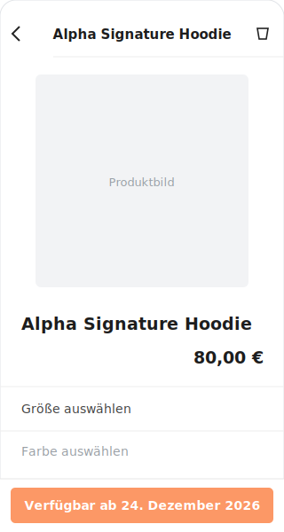
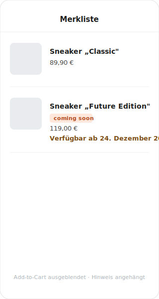
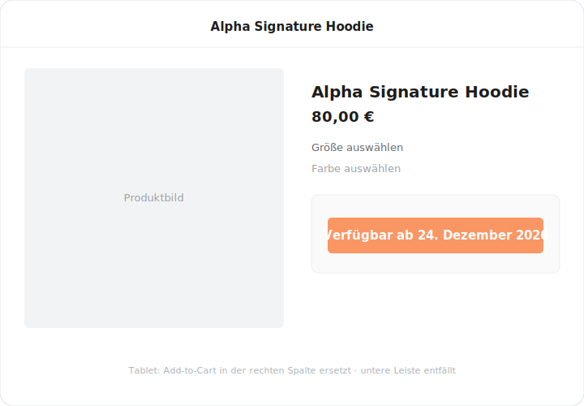

# @shopgate-project/ext-coming-soon

Replaces the **add-to-cart** action with an **"Available on &lt;date&gt;"** bar
for products that are not yet purchasable (their `firstAvailableDate` lies in the
future), and shows a short availability notice on the favourites list.
Works on **phone and tablet**, frontend-only (over-the-air, no native change).

> **Type: Custom** — a project/merchant-specific extension (`@shopgate-project/…`
> scope), **not** a core Shopgate feature. Built for **Shopgate Engage / PWA 7.x**
> (`theme-ios11`, and the tablet layout via
> [`ext-tablet-adjustments`](https://github.com/shopgate-professional-services/ext-tablet-adjustments)).

## Screenshots

| Phone — PDP | Phone — favourites | Tablet — PDP |
|---|---|---|
|  |  |  |

> Illustrations reflecting the live-verified rendering (real theme colours +
> locale text). Replace with PNG screenshots under `docs/screenshots/` when handy.

## What it does

For a product whose `firstAvailableDate` is in the future, the add-to-cart is
replaced by a greyed "available on &lt;date&gt;" bar (phone: bottom bar; tablet:
right-column button), the inline/favourites add-to-cart is hidden, and an
availability notice is appended after the product name on the favourites list.
For every other product nothing changes.

## Portals

Registered via `components` in
[`extension-config.json`](extension-config.json); the shared
[`connector.js`](frontend/connector.js) injects `product` (via `getProduct`,
variant-aware, resolved per item) and `isTablet`.

| Portal | Surface | Coming-soon | Otherwise |
|---|---|---|---|
| `product.ctas.add-to-cart` | PDP inline CTA | hide | children |
| `product.add-to-cart-bar.before` | PDP bottom bar (phone) | availability bar + hide real bar | nothing |
| `product.tablet.right-column.add-to-cart` | PDP right column (tablet) | availability bar | children |
| `favorites.add-to-cart` | favourites list | hide | children |
| `favorites.product-name.after` | favourites list | availability notice | nothing |

## Coexistence with other extensions

`ext-tablet-adjustments` also targets `product.add-to-cart-bar` (to nullify it on
tablet). Two extensions overriding the same portal → only the last wins (by
registration order, not controllable by a single extension). To stay
order-independent, this extension does **not** override that portal: it renders
the phone bar in the additive `product.add-to-cart-bar.before` slot and hides the
real bar (`.theme__product__add-to-cart-bar`) via a conditionally-mounted scoped
`<style>` (only while a coming-soon product is shown). On tablet the phone slot
renders nothing.

> **Known risk:** the hide depends on the theme CSS class
> `.theme__product__add-to-cart-bar`. If a future theme renames it, both bars
> would show (product orderable). Verified against **theme-ios11 7.30.4** —
> re-check the selector when bumping the theme.

## Styling & configuration

The bars mirror the theme add-to-cart button 1:1 (colours, font, radius, padding,
and on phone the bar container/shadow/safe-area) — all read from `themeConfig`,
so they follow the merchant's theme. The only visual difference is a configurable
greying `opacity`.

| Key | Type | Default | Description |
|---|---|---|---|
| `comingSoonBarOpacity` | admin / number | `0.6` | Greyness of the bar (0–1). Set in the Developer Center; delivered to the generated `frontend/config.json`; parsed + clamped in the bar components, falling back to `0.6` when unset. |

## Data source

Reads the product's top-level `firstAvailableDate`, already delivered by the core
catalog (`shopgate.catalog.getProduct.v1`) — no backend step required.

## Open items before production

1. **Favourites payload:** per-item resolution is wired via the slot's
   `id`/`productId` prop; still confirm the favourites pipeline
   (`getProductsByIds`) delivers `firstAvailableDate` per item on a real
   coming-soon product (sandbox test products have no date set).
2. **Variant- vs product-level** availability — clarify whether the date differs
   per variant.
3. **Timezone:** date-only values (`"YYYY-MM-DD"`) are parsed as local midnight to
   avoid a UTC off-by-one; confirm the desired switch-over if the catalog ever
   sends full timestamps.
4. **Scope:** PDP + favourites only (PLP, sliders, cart out of scope) — confirm.
